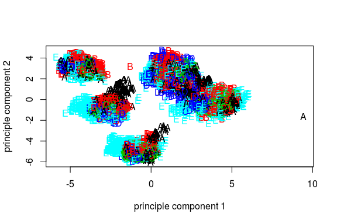
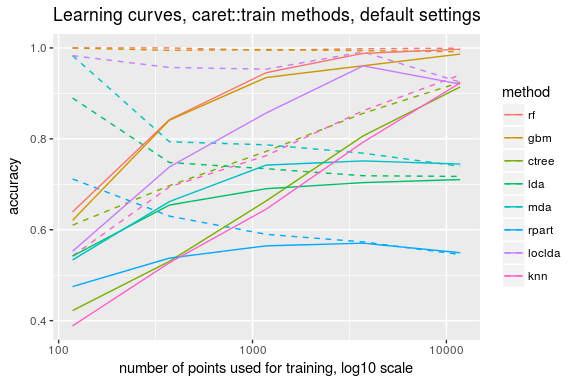

# Predicting Exercise Proficiency
R. A. Reitmeyer  
February 5, 2017  

# Abstract

This paper demonstrates the ability to predict exercise proficiency
from accelerometer data on weight lifting, using a random forests
model and the R "caret" package. The model was selected from a 
variety of possible modeling techniques, on the basis of the accuracy
of prediction against a hold-out set of the training data. Cross-validation 
was performed with the default caret::train technique of bootstrap 
resampling. The rf model achieves better than 99% out-of-sample accuracy 
when fit to a 11776-row subset of the original training data and tested on
non-overlapping 3923-row subset of the original training data. A variety
of other models were tried and will be briefly compared in graphical form.

This is a class project for the coursera "Practical Machine Learning"
class. For ease of grading, R code will be shown, in line, instead
of being available separately. Please skip over the light-gray code 
blocks unless interested in the code. The author has sympathy for anyone 
who thinks the code blocks excessively breaks up the text of the paper 
itself, but it seemed the lesser evil.


```r
# create a supress-output function for use later
suppressAll <- function(fn, ...) {
  retval <- NULL
  tryCatch({
    sink('out')
    suppressWarnings(suppressMessages(
      retval <- fn(...)
    ))
    },
    error=function(e){}
  )
  if(sink.number()>0) {
    sink()
  }
  return(retval)
}
# get all the library loading out of the way.
library(gbm, verbose=FALSE, quietly=TRUE)
```

```
## Loaded gbm 2.1.1
```

```r
library(ggplot2, verbose=FALSE, quietly=TRUE)
library(kernlab, verbose=FALSE, quietly=TRUE)
```

```
## 
## Attaching package: 'kernlab'
```

```
## The following object is masked from 'package:ggplot2':
## 
##     alpha
```

```r
library(lattice, verbose=FALSE, quietly=TRUE)
library(pander, verbose=FALSE, quietly=TRUE)
library(parallel, verbose=FALSE, quietly=TRUE)
library(plyr, verbose=FALSE, quietly=TRUE)
library(randomForest, verbose=FALSE, quietly=TRUE)
```

```
## randomForest 4.6-12
```

```
## Type rfNews() to see new features/changes/bug fixes.
```

```
## 
## Attaching package: 'randomForest'
```

```
## The following object is masked from 'package:ggplot2':
## 
##     margin
```

```r
library(splines, verbose=FALSE, quietly=TRUE)
library(survival, verbose=FALSE, quietly=TRUE)
library(ModelMetrics, verbose=FALSE, quietly=TRUE)
library(caret, verbose=FALSE, quietly=TRUE)
```

```
## 
## Attaching package: 'caret'
```

```
## The following objects are masked from 'package:ModelMetrics':
## 
##     confusionMatrix, precision, recall, sensitivity, specificity
```

```
## The following object is masked from 'package:survival':
## 
##     cluster
```


```r
# Download a copy of the data to local dir (as a cache, to avoid
# downloading repeatedly) and load into memory.
train_filename <- 'train.csv'; train_url <- 'https://d396qusza40orc.cloudfront.net/predmachlearn/pml-training.csv'
if (!file.exists(train_filename))
    download.file(train_url, train_filename, method='curl')
test_filename <- 'test.csv'; test_url <- 'https://d396qusza40orc.cloudfront.net/predmachlearn/pml-testing.csv'
if (!file.exists(test_filename))
    download.file(test_url, test_filename, method='curl')
overall_train <- read.csv(train_filename, na.strings=c('NA','#DIV/0!'))
overall_test <- read.csv(test_filename, na.strings=c('NA','#DIV/0!'))
# set seed
set.seed(123456)
# shuffle data to remove structure in ordering (viz stairstep pattern in dates)
overall_train <- overall_train[sample(nrow(overall_train)),]
# don't shuffle overall test, as unsure how those will be labeled.
# overall_test <- overall_test[sample(nrow(overall_test)),]

# Break overall_train into three sets, train, validate and test
# as 60:20:20 split in anticpation of training a bunch of models
# on 60% of the data, training a bagging algorithm / meta-model
# on the next 20%, and estimating prediction error on the last 20%.
train_idx <- caret::createDataPartition(overall_train$classe, p=0.6, list=FALSE)
train <- overall_train[train_idx,]
non_train <- overall_train[-c(train_idx),]
validation_idx <- caret::createDataPartition(non_train$classe, p=0.5, list=FALSE)
validation <- non_train[validation_idx,]
test <- non_train[-c(validation_idx),]
```


# Introduction

Data comes from the HAR project, with train and test data available at
[``https://d396qusza40orc.cloudfront.net/predmachlearn/pml-training.csv``](``https://d396qusza40orc.cloudfront.net/predmachlearn/pml-training.csv``) and [``https://d396qusza40orc.cloudfront.net/predmachlearn/pml-testing.csv``](``https://d396qusza40orc.cloudfront.net/predmachlearn/pml-testing.csv``), respectively.

Data represents activity over two days at the end of November 2011 and
two days at the start of December 2015, as recorded by accelerometers
during exercise. Each exercise was done correctly, as "classe" A, and
in several incorrect techniques as "B" ... "E".

The initial analysis plan was to fit several models with a variety of
techniques, then fit a "bagged" meta-model, and check overall accuracy
of the metamodel on a held-out data set. Initial training data was split 
into 60:20:20 train/test/validation sets to reflect this, with all model
training on the train set.


## Data cleaning

Raw training data has 19622 rows and 160 columns, with "NA" and "!DIV/0!" 
values, both treated as NA. Data is more often missing than not, with 
many columns having in excess of 97.5% NA values.

Columns with more than 75% NA were removed, as well as low variance 
columns identified by caret::nearZeroVar applied to the model training set.
Similarly, row number, user name and date/time columns that may have 
spurrious correlations but do not assist with predicting from accelerometer 
readings have been removed. This left 53 columns for prediction of the
"classe" column.


```r
# Cleanup and Visualization
spurrious_cols <- c('X','user_name','raw_timestamp_part_1','raw_timestamp_part_2','cvtd_timestamp')
pct_na <- function(data) 100*sum(is.na(data))/length(data)
na_cols <- names(train)[(sapply(train, pct_na) > 75)]
nzv <- names(train)[caret::nearZeroVar(train)]
remove_cols <- union(c(spurrious_cols, nzv), na_cols)
keep_cols <- setdiff(names(test), remove_cols)
predict_cols <- setdiff(keep_cols, 'classe')
train <- train[,keep_cols]
test <- test[,keep_cols]
validation <- validation[,keep_cols]
overall_train <- overall_train[,keep_cols]
overall_test <- overall_test[,intersect(names(overall_test),keep_cols)]

# Metrics: consider accuracy, precision, recall and f1score
score_helper_acc <- function(act, pred) {sum(act==pred)/length(act)}
make_score_fn <- function(score_helper_fn=score_helper_acc) {
  return (function(fit, data, resp='classe') {
    pred_cols <- setdiff(names(data), resp)
    score_helper_fn(data[,resp], predict(fit, data[,pred_cols], type='raw'))
  })
}
acc <- make_score_fn(score_helper_acc)
precision <- make_score_fn(ModelMetrics::precision)
recall <- make_score_fn(ModelMetrics::recall)
f1 <- make_score_fn(ModelMetrics::f1Score)
```

Columns used: num_window, roll_belt, pitch_belt, yaw_belt, total_accel_belt, gyros_belt_x, gyros_belt_y, gyros_belt_z, accel_belt_x, accel_belt_y, accel_belt_z, magnet_belt_x, magnet_belt_y, magnet_belt_z, roll_arm, pitch_arm, yaw_arm, total_accel_arm, gyros_arm_x, gyros_arm_y, gyros_arm_z, accel_arm_x, accel_arm_y, accel_arm_z, magnet_arm_x, magnet_arm_y, magnet_arm_z, roll_dumbbell, pitch_dumbbell, yaw_dumbbell, total_accel_dumbbell, gyros_dumbbell_x, gyros_dumbbell_y, gyros_dumbbell_z, accel_dumbbell_x, accel_dumbbell_y, accel_dumbbell_z, magnet_dumbbell_x, magnet_dumbbell_y, magnet_dumbbell_z, roll_forearm, pitch_forearm, yaw_forearm, total_accel_forearm, gyros_forearm_x, gyros_forearm_y, gyros_forearm_z, accel_forearm_x, accel_forearm_y, accel_forearm_z, magnet_forearm_x, magnet_forearm_y, magnet_forearm_z.


## Visualization with Naive PCA

The data is complex and overlapping. Reducing dimensions of the predictor 
variables with PCA to make it suitable for plotting shows a structure,
but one unrelated to the classification response.


```r
# Basic PCA
train_pca <- prcomp(train[,predict_cols],center=TRUE,scale=TRUE)
plot_pca_x <- function(data, x1, x2, col) {
  plot(data[,x1], data[,x2], col=col, pch=as.character(col), xlab='principle component 1', ylab='principle component 2')
}

plot_pca_x(train_pca$x, 1, 2, train[,'classe'])
```

<!-- -->


# Modeling

Modeling was performed with the caret package, to train a variety
of models on the 'train' subset of the data.  All modeling was done
with the caret::train defaults.

Note that caret::train uses resampling as the default cross-validation
method, with 25 resamples.

The author expected this would produce a number of plausible fits 
that could then be combined into a meta-model, trained on a held-out
test set from 20% of the original training data.  The final meta-model
would then be validated against a separate 20% of
the original training data.


```r
# Fit with caret, by method name. Since some things run a long, long time, cache results
# to disk by menthod name, data name and data size. Reload if one of those is available.
manyfits_caret <- function(data, formula_str, method_names=c('rf'), data_name='train', trControl=NULL) {
  lapply(method_names, function(m) {
    if (is.null(trControl)) {
      trControl <- caret::trainControl()
    }
    set.seed(892323)
    savefilename <- sprintf('fit_%s_%s_%d.Rdata', m, data_name, nrow(data))
    if (file.exists(savefilename)) {
      load(savefilename)
      return(retval)
    } else {
      print(sprintf('starting method %s', m))
      can_do_multiclass <- FALSE
      tryCatch({
        sink('out')
        suppressWarnings(suppressMessages(
          caret::train(Species ~ ., data=iris, method=m, trControl=trControl)
        ))
        can_do_multiclass <- TRUE
      }, 
      error=function(e){print(e);print('but kept going in error handler')},
      finally=if(sink.number()>0){sink()}
      )
      if (can_do_multiclass) {
        elapsed<-system.time(fit <- caret::train(as.formula(formula_str), data=data, method=m, trControl=trControl))
        print(sprintf("finished method %s in %f seconds", m, elapsed[3]))
        retval <- list(method=m, can_do_multiclass=TRUE, elapsed=elapsed, fit=fit)
      } else {
        retval <- list(method=m, can_do_multiclass=FALSE)
      }
      save(retval, file=savefilename)
      return(retval)
    }
  }
  #, mc.preschedule=FALSE, mc.cores=3
  )
}

caret_methods <- c('rf','gbm','ctree','lda','mda','rpart','loclda','knn')

# Train some toy model sizes to confirm things work and get a sense of how model size
# impacts performance, and allow for building some learning curves.
# Note the data was already shuffled into random order. Pick 
# sizes 1/100th and 1/10th before doing full model, and then chose geometric
# means of those to add a few more points.
mf_caret_train_118 <- manyfits_caret(train[1:118,], "classe ~ .", caret_methods) 
mf_caret_train_373 <- manyfits_caret(train[1:373,], "classe ~ .", caret_methods) 
mf_caret_train_1178 <- manyfits_caret(train[1:1178,], "classe ~ .", caret_methods) 
mf_caret_train_3724 <- manyfits_caret(train[1:3724,], "classe ~ .", setdiff(caret_methods, 'gbm')) # no time for gbm
mf_caret_train <- manyfits_caret(train, "classe ~ .", caret_methods) 

# Build a learning curve data frame.
n=c(118,373,1178,3724,11776)
mf_caret_all <- list(mf_caret_train_118, mf_caret_train_373, mf_caret_train_1178, mf_caret_train_3724, mf_caret_train)
if (!file.exists('learning_curve.Rdata')) {
  learning_curve_data <- suppressAll(do.call, rbind, lapply(1:5, function(i) {
    do.call(rbind, lapply(mf_caret_all[[i]], function(l) {
      retval <- data.frame(points=n[i], method=l$method, 
                 train_accuracy=acc(l$fit, train[1:n[[i]],]),
                 test_accuracy=acc(l$fit, test))
      return(retval)
    }))
  }))
  save(learning_curve_data, file='learning_curve.Rdata')
} else {
  load('learning_curve.Rdata')
}
learning_curve_data$test_errors <- nrow(test)*(1-learning_curve_data$test_accuracy)
```

A learning curve shows how model accuracy for train (in-sample) and
test (out-of-sample) data as the number of points for training increases.
Typical behavior, after startup effects, is for training curves to fall
as simple overfiting is penalized, and testing curves to increase as the
model better learns the data.

Here each method is shown by color, with training accuracy as dashed lines,
and test accuracy as solid lines.


```r
ggplot(learning_curve_data, aes(x=points))+
  geom_line(aes(y=train_accuracy, group=method, color=method), linetype='dashed')+
  geom_line(aes(y=test_accuracy, group=method, color=method), linetype='solid')+
  scale_x_log10()+
  ggtitle("Learning curves, caret::train methods, default settings")+
  xlab("number of points used for training, log10 scale")+
  ylab("accuracy")
```

<!-- -->

From the learning curves, it is apparent that the rf (random forests)
method performs best with the available data, with a test set
accuracy of 
``0.9972``,
followed by gbm (generalized boosted models) method with test set 
accuracy of
``0.98649``.


Other methods did not perform as well. 


```r
pander(subset(learning_curve_data, points==11776))
```


-------------------------------------------------------------------------
 &nbsp;   points   method   train_accuracy   test_accuracy   test_errors 
-------- -------- -------- ---------------- --------------- -------------
 **32**   11776      rf         0.9995          0.9972           11      

 **33**   11776     gbm         0.9917          0.9865           53      

 **34**   11776    ctree        0.9243          0.9141           337     

 **35**   11776     lda         0.7174          0.7104          1136     

 **36**   11776     mda         0.7397          0.7446          1002     

 **37**   11776    rpart        0.5455          0.5493          1768     

 **38**   11776    loclda       0.9247          0.9205           312     

 **39**   11776     knn         0.9407           0.923           302     
-------------------------------------------------------------------------


## Final predictions

Since gbm has roughly 5x the errors of random forest, and no other 
method is close, a simple random forest method will be used for final 
predictions. 

While it is important to hold data out for model selection and model
tuning, the learning curve shows that training the model on more data
improves it. Moving from 3724 points to 11776 points (a factor of 3.16)
increased rf accuracy from 


```r
pander(subset(learning_curve_data, method=='rf'))
```


-------------------------------------------------------------------------
 &nbsp;   points   method   train_accuracy   test_accuracy   test_errors 
-------- -------- -------- ---------------- --------------- -------------
 **1**     118       rf           1             0.6393          1415     

 **9**     373       rf           1             0.8422           619     

 **17**    1178      rf         0.9949          0.9457           213     

 **25**    3724      rf         0.9984           0.988           47      

 **32**   11776      rf         0.9995          0.9972           11      
-------------------------------------------------------------------------

So (to copy an idea from kaggle.com contests where data scientists compete on
predictive power) a "production" model for final fits should be trained on all 
of the data.  By training on all the data (a factor of 1.66 more than the test 
subset), expected accuracy should be higher than 
``0.9972``.


```r
# Use Kaggle leaderboard technique: train on all the data once you have a "good" 
# model, to be further to the right on the learning curve.... if it's not flat.
mf_train_overall <- manyfits_caret(overall_train, "classe ~ .", 'rf', data_name='overall_train')
overall_test_predictions <- predict(mf_train_overall[[1]]$fit, overall_test)
write.csv(overall_test_predictions, file='overall_test_predictions.csv')
```


## Estimated accuracy of final fit

The caret fit has cross validation / resampling accuracy as part of the fit,
so even without an explicit holdout, accuracy can be estimated.


```r
mf_train_overall_accuracy <- mf_train_overall[[1]]$fit$resample$Accuracy
pander(data.frame(resample=1:length(mf_train_overall_accuracy), accuracy=mf_train_overall_accuracy))
```


---------------------
 resample   accuracy 
---------- ----------
    1        0.9985  

    2        0.9958  

    3        0.9974  

    4        0.9978  

    5        0.997   

    6        0.9976  

    7        0.9981  

    8        0.9961  

    9        0.9976  

    10       0.9986  

    11       0.9972  

    12       0.9976  

    13       0.9978  

    14       0.9971  

    15       0.9982  

    16       0.9975  

    17       0.9985  

    18       0.9977  

    19       0.9972  

    20       0.9981  

    21       0.9983  

    22       0.9981  

    23       0.9957  

    24       0.9967  

    25       0.9986  
---------------------

The average accuracy across these samples is 
0.99755


# Conclusion

Random forest was the best method, using all default caret parameters. The error
rate was roughly 1/5th that of the second-best technique, gradient boosted
models. Out of sample prediction accuracy with 11776 training data points was 
``0.9972``..
The final prediction model, which uses all points, is expected to perform even better.

