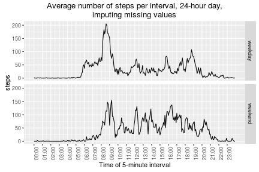

## Loading and preprocessing the data

The first step in the assignment is to load the data.


```r
data <- read.csv(base::unz('activity.zip', 'activity.csv'))
# turn dates into actual R dates.
data$date <- as.Date(data$date, format='%Y-%m-%d')
# Times are encoded as number 0, 5, 10 ... 55, 100, 105, 110 ... 155, 200
# which are clearly hours in the 100s place, and minutes in what's left.
# Make a interval_f to hold more recognizable times.
minute <- data$interval %% 100
hour <- (data$interval - minute) / 100
data$interval_f <- factor(sprintf('%02d:%02d', hour, minute))
rm(minute)
rm(hour)
```


## What is mean total number of steps taken per day?

Calculating the mean total number of steps per day starts by forming
a new data frame with one row for every day, and a column with the
total number of steps that day.

```r
library(dplyr)
daily_steps <- data %>% 
    dplyr::group_by(date) %>% 
    dplyr::summarize(steps=sum(steps, na.rm=TRUE))
mean_daily_steps <- mean(daily_steps$steps)
median_daily_steps <- median(daily_steps$steps)
options(scipen=1, digits=2) # limit decimal places shown.
```

Ignorning missing values, the mean total number of daily steps 
is 9354.23; the median is 10395. 
Graphically as a histogram:


```r
hist(daily_steps$steps, breaks=20, main='Histogram of mean total daily steps',
sub='ignorning missing values')
```


## What is the average daily activity pattern?

The daily average activity pattern begins with forming a new data
frame with the number of steps averaged per interval.


```r
# Make a function to re-use for later with imputed data
make_daily_pattern <- function(data, extra_cols=c())
{
    data %>% 
        dplyr::group_by_(.dots=c('interval_f', extra_cols)) %>% 
        dplyr::summarize(steps=mean(steps, na.rm=TRUE))
}
daily_pattern <- make_daily_pattern(data)
```

Graphically with ggplot2:


```r
library(ggplot2)
# Make a function to reuse for later
make_steps_per_interval_plot <- function(data, extra_cols=c())
{
    daily_pattern <- make_daily_pattern(data, extra_cols)
    hours <- grep(':00$', unique(data$interval_f), value=TRUE)
    breaks <- which(unique(data$interval_f) %in% hours)
    # Note: to make a line plot, must use interval_f as a numeric value.
    p <- ggplot(daily_pattern, aes(x=as.numeric(interval_f), y=steps))+
        geom_line()+
        scale_x_continuous(breaks=breaks, labels=hours)+
        theme(axis.text.x = element_text(angle = 90, hjust = 1))+
        ggtitle('Average number of steps per interval, 24-hour day,\nignoring missing values')+
        xlab('Time of 5-minute interval')
    return (p)
}
make_steps_per_interval_plot(data)
```


```r
peak_time_interval <- daily_pattern$interval_f[which.max(daily_pattern$steps)]
```
The peak time interval, with the highest activity on an average day, is 08:35.


## Imputing missing values

The data set has 2304 missing rows, out of
17568 rows total, so 13.11% 
is missing.

Within the scope for this project, a simple, single-imputation approach
seems appropriate, and using a median (rather than a mean) will reduce
the influence of outliers. The biggest decision is what median to take;
the data can give guidance here, by looking for patterns in the missing values.


```r
interval_na_pattern <- data %>% 
    dplyr::group_by(interval_f) %>% 
    dplyr::summarize(na_steps=sum(is.na(steps)), non_na_steps=sum(!is.na(steps)))
# When writing this report, each interval has same number of NA and non-NA steps.
# Confim this, don't assume it, to be 'reproduceable.' (Or in case data changes!)
with(interval_na_pattern, stopifnot(min(na_steps) == max(na_steps)))
with(interval_na_pattern, stopifnot(min(non_na_steps) == max(non_na_steps)))
```

Within each interval, there are always 8 missing values, and 53 non-missing values.

This suggests the best imputation strategy is to assign missing values based
on the (non-NA) steps from each interval. 


```r
median_by_interval <- data %>%         # form a median for each interval
    dplyr::group_by(interval_f) %>% 
    dplyr::summarize(median_steps=median(steps, na.rm=TRUE))
imputed_data <- merge(data, median_by_interval, by='interval_f')
imputed_data$imputed <- is.na(imputed_data$steps) # track which points are imputed
imputed_data$steps[imputed_data$imputed] <-
    imputed_data$median_steps[imputed_data$imputed]
```

With the imputed data, daily steps can be computed very similarly
to how it was found previously.


```r
imputed_daily_steps <- imputed_data %>% 
    dplyr::group_by(date) %>% 
    dplyr::summarize(steps=sum(steps, na.rm=TRUE))
mean_imputed_daily_steps <- mean(imputed_daily_steps$steps)
median_imputed_daily_steps <- median(imputed_daily_steps$steps)
```

Using the imputed values to handle missing data, the histogram for
(average) total number of steps per day changes slightly:


```r
hist(daily_steps$steps, breaks=20, main='Histogram of mean total daily steps', sub='imputing missing values')
```


Using the inputed data, the mean total number of daily steps 
is 9503.87, up from the earlier value of
9354.23; the median is 10395
which is unchanged from the earlier median (10395).

This is as expected from using the median for imputation.


## Are there differences in activity patterns between weekdays and weekends?

It's straightforward to make a new column for whether the
data comes from a weekend or a weekday.


```r
imputed_data$weekend <- factor(with(imputed_data, 
    ifelse(weekdays(date) %in% c('Saturday','Sunday'),
        'weekend', 'weekday')))
```

And then to use that to make a steps-per-interval plot similar to what
was shown earlier, but contrasting between weekend and weekdays.


```r
make_steps_per_interval_plot(imputed_data, 'weekend')+
    facet_grid(weekend~.)+
    ggtitle('Average number of steps per interval, 24-hour day,\nimputing missing values')
```




